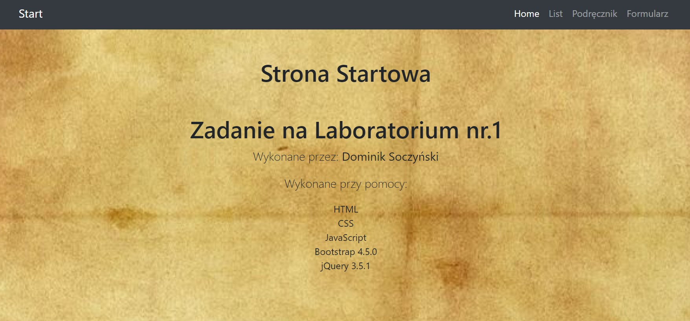
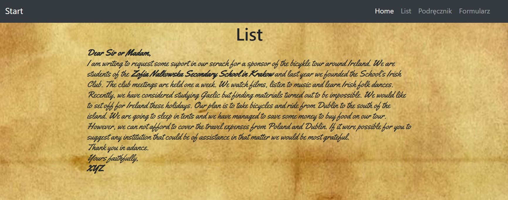
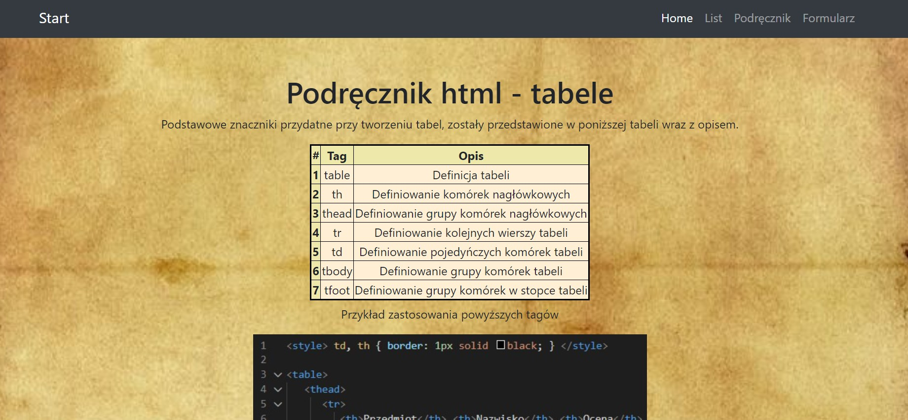
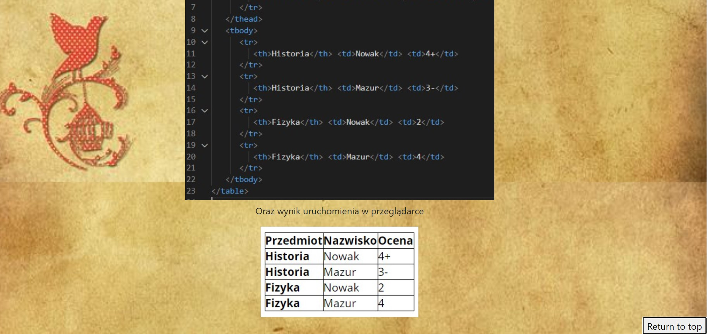
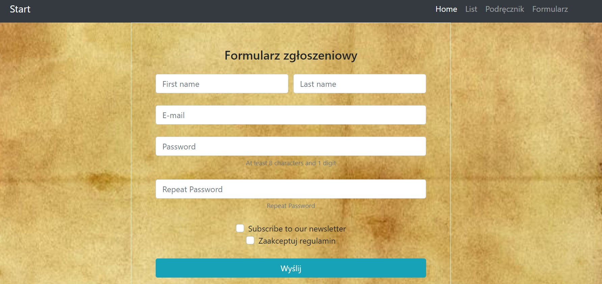

# Projektowanie-Serwisow-WWW-Soczynski-185IC
 
**Lab1 - Praca z systemem kontroli wersji. Podstawy WWW**

Stworzyć prostą stronę WWW, nie wymagającą użycia serwera webowego.
Strona powinna zawierać linki do trzech podstron
- na stronie startowej należy umieścić informację o autorze oraz opcjonalnie np. logo, informacje o użytych technologiach itp.

- strona z listem (odpowiednio sformatowany tekst, przypominający list).

- strona z podręcznika, np. do informatyki (rysunki, tabele, wzory itp.).

- strona z formularzem (inputy, pola tekstowe, checkboxy itp.), na początku bez walidacji wartości pól.

    
Należy użyć HTML, CSS i JS do ww. zadania