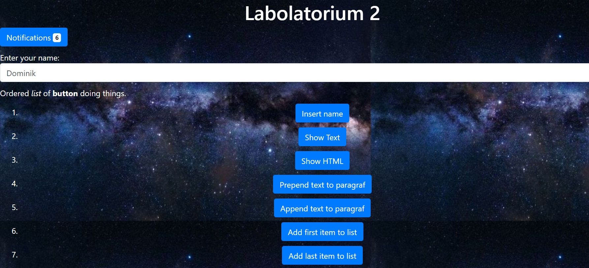

# Projektowanie-Serwisow-WWW-Soczynski-185IC
 
**Lab2 - Praca z elementami DOM + ćwiczenia**

Zadanie polega na wykorzystaniu Java Script (vanilla, jQuery lub inny) do wyświeltlania, modyfikowania, tworzenia (itp. itd.) elementów strony związanych z HTML i CSS,
należy użyć wybrany (dowolny) framework front-endowy do tego zadania,
jeden z najpopularniejszych to Bootstrap, UI Kit.

Na przykład korzystając z szablonu Bootstrap, można dodać przycisk z klasą badge-light do strony (np. pod nagłówkiem ‘Hello world’), a np. przed końcem sekcji body wrzucamy skrypt, który szuka elementu z klasą badge-light i ustawia jego wartość (innerHTML) na liczbę 6.

W podobny sposób należy wykorzystać inne dostępne metody Java Script do modyfikacji elementów strony,
wskazane użycie około 20 różnych elementów Java Script do ww. modyfikacji.
użyj w wybranych przez siebie fragmentach kodu “trybu ścisłego” - use strict.
można do pomocy wykorzystać jQuery.

**Wygląd strony po uruchomieniu**

Część wyników wciśnięcia klawiszy pojawia się w konsoli strony