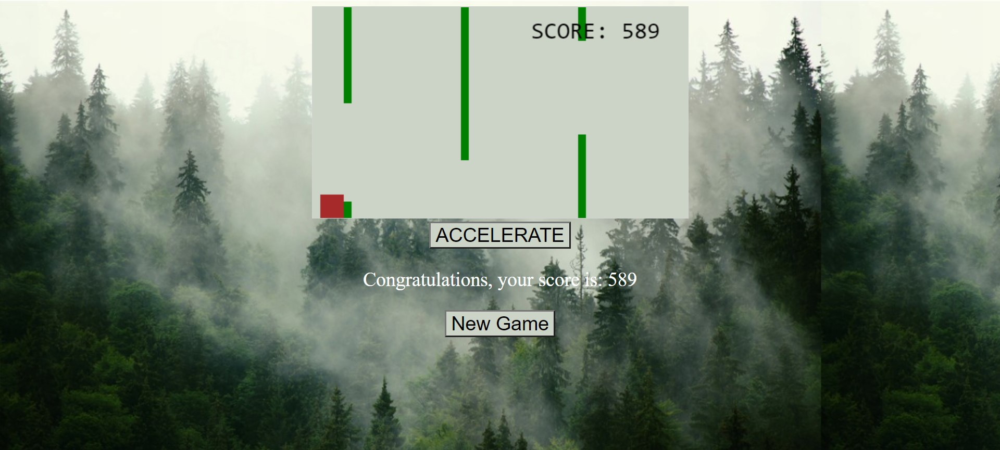

# Projektowanie-Serwisow-WWW-Soczynski-185IC

**Lab4 - Gra przeglądarkowa**

Do zrealizowania jest prosta gra przeglądarkowa, inna niż była omawiana na zajęciach.
Należy wykorzystać element do implementowania podstawowych mechanik gry jak renderowanie, przesuwanie grafik, wykrywanie kolizji, mechanizmu sterowania oraz stanu wygrania/przegrania.
Nie należy korzystać z silników gier, dopuszczalna prosta biblioteka JS, np. jQuery.
Wskazany dokładny opis tego, co robi dana funkcja lub wybrany fragment kodu.
Wskazane użycie event listenerów, obsługa klawiszy i/lub myszki, itp.
Plusy za modyfikacje, dobre komentarze i oryginalność.

**Widon strony oraz początek gry**

**Widok po kolizji z przeszkodą**

