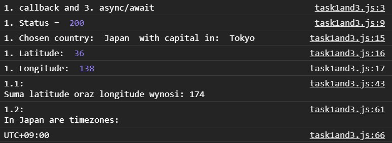
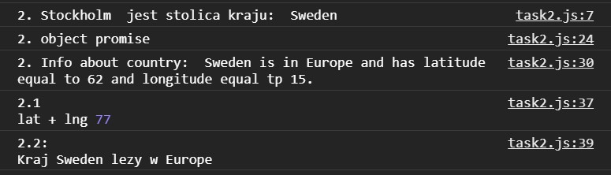
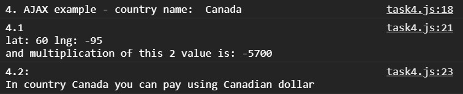
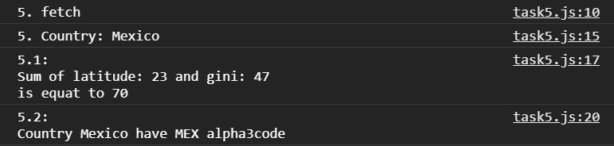
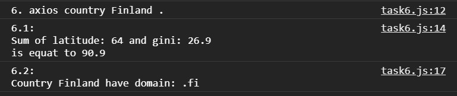

# Projektowanie-Serwisow-WWW-Soczynski-185IC

**Lab5 - Asynchroniczny Java Script**

**Task 1**
funkcja zwrotna (callback)

utwórz obiekt JSON, zawierający w środku co najmniej podwójnie zagnieżdżone obiekty JSON;
- task1: wykorzystaj funkcję zwrotną do pobrania dwóch różnych wartości liczbowych (z różnych poziomów zagnieżdżenia) z ww. obiektu JSON i wykonaj wybrane działanie na tych liczbach,
- task 2: wykorzystaj funkcję zwrotną do pobrania dwóch różnych łańcuchów znakowych (z różnych poziomów zagnieżdżenia) z ww. obiektu JSON i za pomocą template strings stwórz łańcuch znakowy z użyciem obu wcześniej wyekstrahowanych łańcuchów znakowych.

**Wynik wywołania skryptu w consoli**

**Task 2**
obiekt Promise

należy pamiętać o obsłudze wszystkich pięciu ( resolve, reject, then(), catch() i finally() ) metod obiektu Promise,
do pobierania zasobów należy wykorzystać metodę fetch lub bibliotekę axios
- task 1: wykorzystaj obiekt Promise do pobrania dwóch różnych zasobów liczbowych i napisz funkcję wykonującą wybrane działanie na tych liczbach,
- task 2: wykorzystaj obiekt Promise do pobrania dwóch różnych dowolnych zasobów i napisz funkcję tworzącą z nich nowy obiekt,

**Wynik wywołania skryptu w consoli**

**Task 4**
Zapytania AJAX

należy obsłużyć sukces zapytania (właściwość ‘onload’ obiektu XHR),
należy obsłużyć błąd zapytania (właściwość ‘onerror’ obiektu XHR).
- task 1: jak wyżej
- task 2: jak wyżej

**Wynik wywołania skryptu w consoli**

**Task 5**
metoda fetch

nie używamy async/await.
- task 1: jak wyżej
- task 2: jak wyżej

**Wynik wywołania skryptu w consoli**

**Task 6**
bibliotexa axios

obiekt axios dostępny będzie jako response.data (patrz przykłady),
nie używamy async/await.
wystarczy użyć plików z CDN, opisanych w linku do biblioteki i umieścić je przed końcem sekcji ‘body’.
- task 1: jak wyżej
- task 2: jak wyżej

**Wynik wywołania skryptu w consoli**

