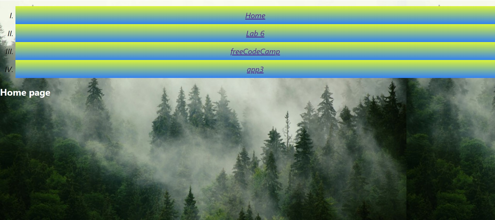
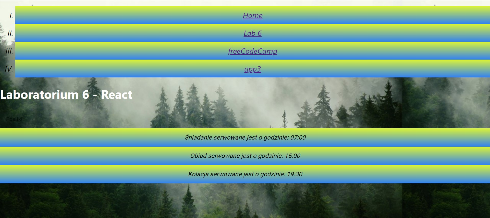
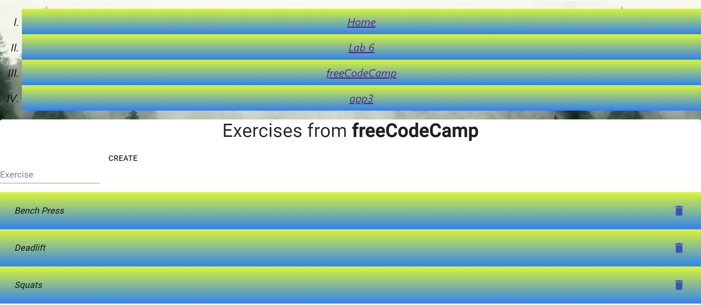
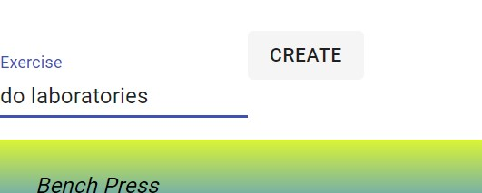
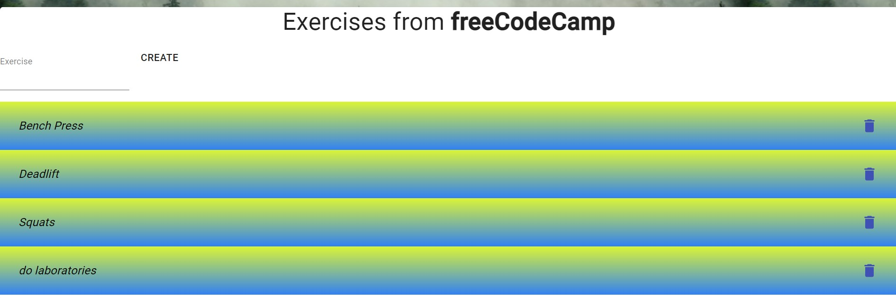
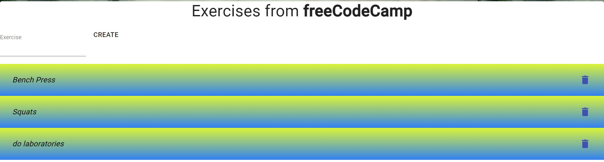
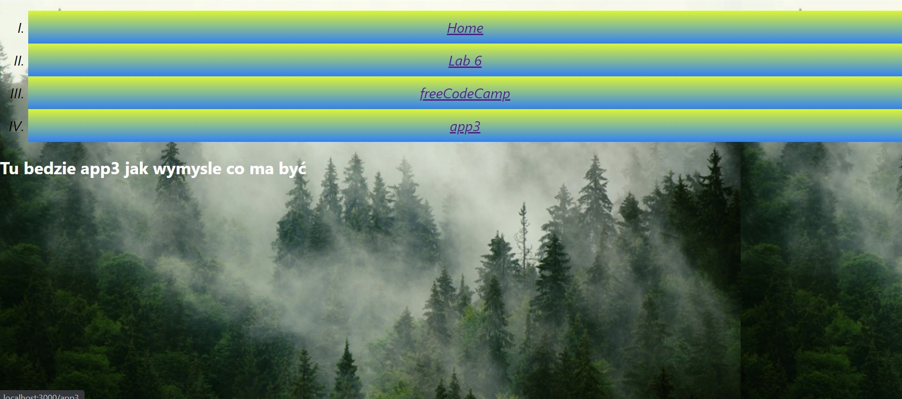

# Projektowanie-Serwisow-WWW-Soczynski-185IC

**Lab 7. React - aplikacja nr 2**
wykorzystanie Material UI oraz React-Router,
instalacja Material UI,
początki z Material UI,
przykład użycia Material UI z freecodecamp,
routing po stronie serwera i po stronie klienta, czyli po co nam Raect-Router, proszę przeczytać przy ☕ lub 🍺 (małym),
instalacja i proste przykłady użycia React-Router’a,
zadanie - wykorzystać dwie ww. biblioteki react’owe do utworzenia prostej SPA:
należy stworzyć trzy “podstrony” (komponenty link, Switch i Route),
na każdej z ww. podstron powinny znaleźć się trzy różne komponenty z Material UI,
plusy ➕➕➕ za wykorzystanie ‘state’, ‘props’, innych bibliotek (np. bootstrap).

Wygląd strony startowej

Wygląd strony z Lab6 zmodyfikowanej pod Material UI

Wygląd strony z kursu freeCodeCamp

Wygląd strony z kursu w trakcie dodawania elementu listy

Wygląd strony z kursu po dodaniu elementu do listy

Wygląd strony z kursu po usunięciu elementu z listy

Wygląd strony app3 (w trakcie tworzenia)

