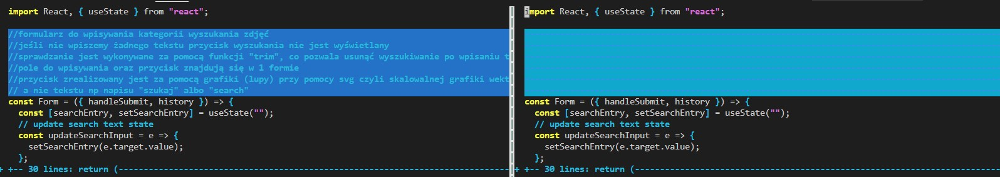

# Projektowanie-Serwisow-WWW-Soczynski-185IC

**Lab8 - React aplikacja nr 3 + analiza kodu źródłowego + git difftool**
- przykład należy przeanalizować i dokonać swoich modyfikacji,
- należy dokładnie opisać (skomentować) kod aplikacji (zainstalowane moduły, użyte komponenty itp.) oraz wprowadzone własne modyfikacje,
- ww. modyfikacje kodu należy zaprezentować wizualnie na zrzucie ekranu po komendzie git difftool
- w pliku README należy umieścić link do oryginalnego przykładu,

Oryginalna strona projektu: https://github.com/Yog9/SnapShot

Wygląd strony - wyszukiwarki zdjęć

Wygląd strony - wyszukiwanie zdjęć z podanej kategorii

Wyniki wywołanie komendy "git difftool" oraz podglądu zmian w plikach

**Różnice w pliku App.js**

**Różnice w pliku Container.js**

**Różnice w pliku Form.js**

**Różnice w pliku Gallery.js**
